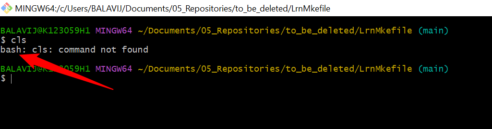
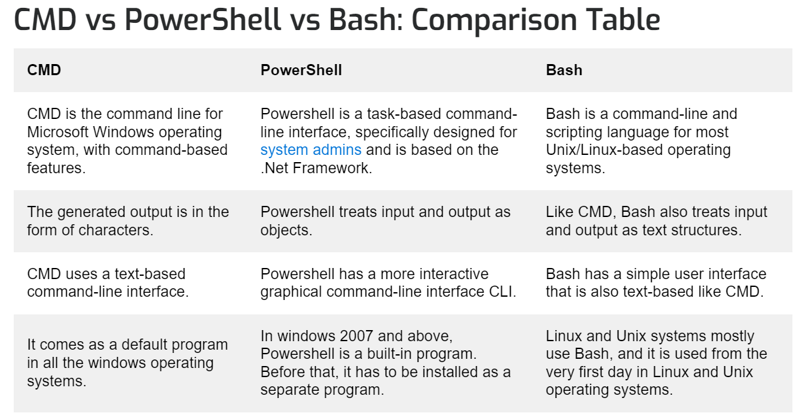

# Some information when working with make and make file.

## References

- https://www.gnu.org/software/make/manual/make.html (Official)
- https://web.mit.edu/gnu/doc/html/make_toc.html (Very old)
- https://makefiletutorial.com/ (also a good one, check the books section, there is a pdf file of the same html document)

1. There are different version of command line interpreter.
    - cmd.exe = command-line interpreter (CLI) for Microsoft Windows
        - When it was launched? 1987. For Windows and some other OS's but not for Unix.
        - Why it is used? - to automate routine tasks.
        - CMD is used as a shell.
        - This has pre-built commands like cd, copy, paste, ping etc.
    
    - Windows Powershell - Launched in 2002.
        - Why? to be equally competetive to Linux Shell for task automation.
        - What is it? This is Command-line shell and has all the features that CMD has and powershell is also object oriented.

    - Bash (Bourne Again Shell) - most popular command line interfaces in UNIX.
        - Bash is a shell equiavalent to Powershell but in UNIX.
        - it is open source, command-line editing available and others like key-binding, command history etc.
        - **This is important - if you download git in windows, it contains bash in it.**

1. Make files
   - Now coming to make files.
   - Beautiful make file tutorial.
   - https://makefiletutorial.com/#why-do-makefiles-exist

   In Windows, there are two kinds of make software.
   - First one is provided by MinGW - make
   - Another one is provided by Msys - make
   - Msys make is better than MinGW as the former will give access to commands which are portable in UNIX systems as well.
   - For example - "rm" is present in msys make but not in mingw make, and some others like "ls" which is list directories present in msys but not in mingw.
   - So use msys make instead of mingw make. 

# Some Very important Links for bash, bash pitfalls, makefile tutorial
### Shell Scripting Tutorial -  https://www.shellscript.sh/hints.html
### Bash Pit falls - https://mywiki.wooledge.org/BashPitfalls
### Make file tutorial - https://makefiletutorial.com/
### keep using this reference to update another information